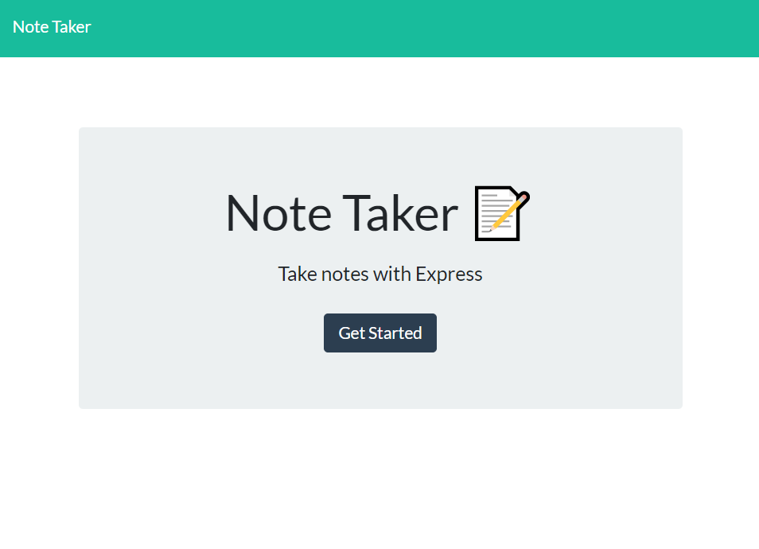
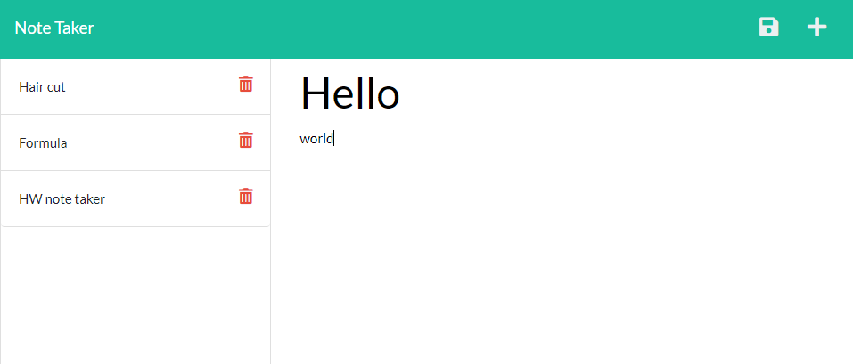

# Express-Note-Taker

## HW Overview

In this unit, we will create our own server-side APIs using the Express.js framework. Express is the most widely used Node.js server framework. It will allow us to quickly and easily establish our API routes and associated HTTP request methods.

Routing is how we design our server to handle responses when a client makes a request at a specific endpoint, or URL. We learned how to make GET requests from the client-side in a previous unit. Now we will learn how those requests are handled on the server-side. Our server will _listen_ for a specific type of request at a specific endpoint and when it _hears_ that request, it will respond accordingly.

We will also learn the HTTP POST request method to submit data to our server.

## Links

* [Heroku](https://expressjs.com/)

